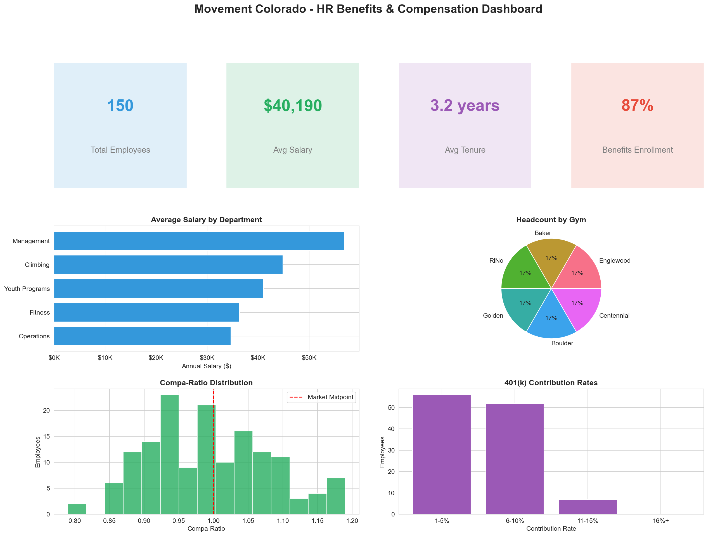
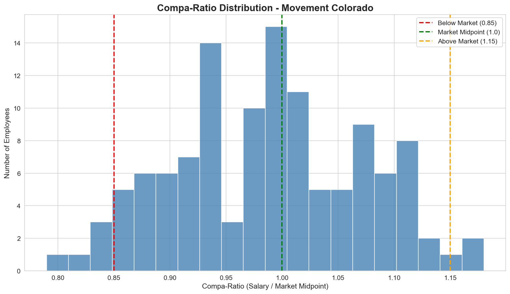
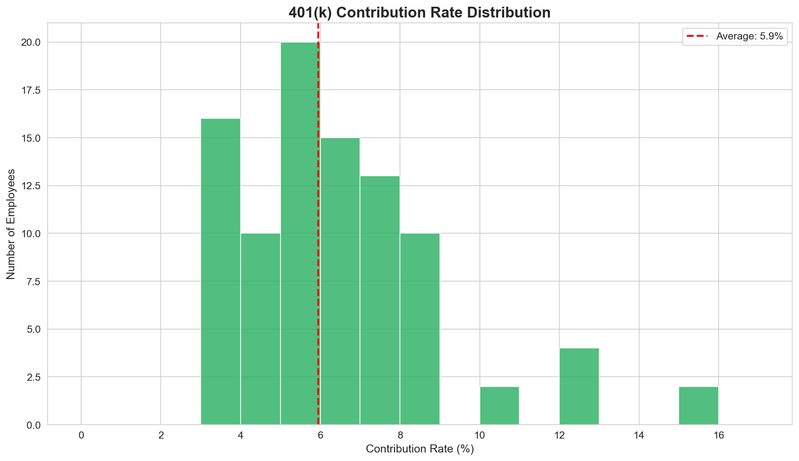
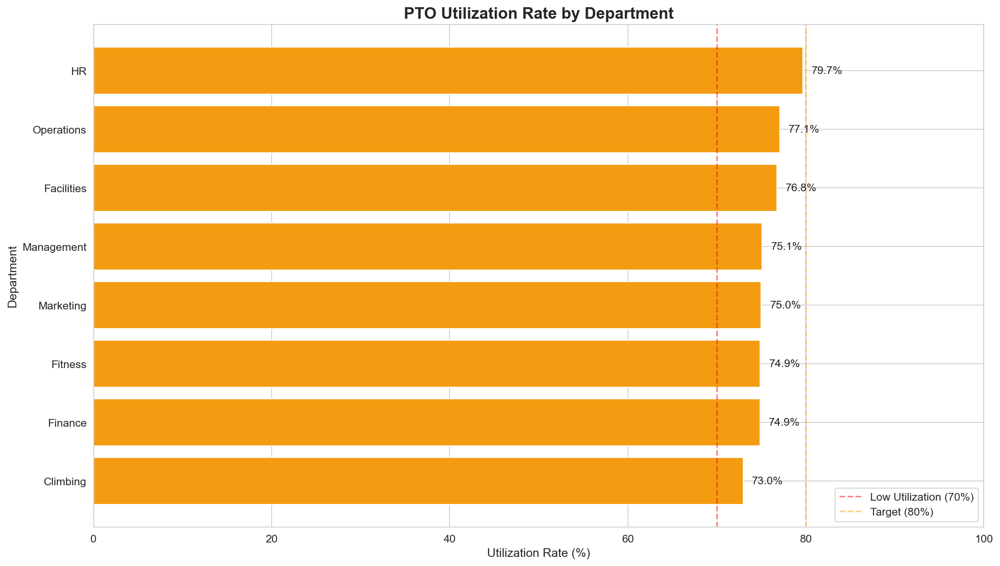

# HR Benefits & Compensation Analysis Dashboard



## 👋 Hi, My name is Peyton Cunningham!

## Used skills to address the needs of the position

**Thank you for taking the time to review my portfolio project!**

When first reading through the job description for the **Benefits & Compensation Administrator** position, I immediately knew that this was a chance to bridge the gap between my skills in data analytics, critical thinking, communication, and passion for Movement's vision. I have spent the past weeks creating sample data and scalable code to address the needs of the position.

As a current **Front Desk Supervisor at Movement Golden**, I have a uniquely keen understanding of the operational needs and challenges of our gyms from a first person experience. As an avid climber and current Movement Employee, I have a thorough understanding of the needs and wants of our team.

In this position I will generate robust metrics that will drive data-driven decisions that will best support financial and operational changes that balance the needs of our team and business. 

### The Goals Of This Project

This project showcases how I will approach the core responsibilities outlined in the job description:
- **Benefits administration** — tracking enrollments, analyzing costs, and ensuring accuracy
- **Compensation analysis** — benchmarking salaries, calculating compa-ratios, and identifying pay equity issues
- **Leave management** — monitoring PTO utilization and calculating liability
- **Data-driven insights** — creating clear visualizations that support decision-making

---

## The Functions Of This Project

This tool analyzes HR data and **produces easy-to-understand reports and charts**. Essentially, it is an automated way to answer questions like:

- *"Are we paying competitively compared to the market?"*
- *"Which departments have the highest benefit costs?"*
- *"How much unused PTO do we have?"*
- *"What percentage of employees are enrolled in our 401(k)?"*

**No technical knowledge required to understand the outputs!** The tool generates visual dashboards and clear reports that any HR professional or executive can interpret.

---

## 📊 The Three Areas of Analysis

### 1. Compensation Analysis
**What it answers:** Are we paying our people fairly and competitively?

| What I Analyze | Why It Matters |
|----------------|----------------|
| **Salary by department & location** | Ensures pay is consistent and accounts for cost of living differences |
| **Compa-ratios** | Shows how each employee's pay compares to market rates (critical for retention) |
| **Pay ranges by job title** | Helps identify compression issues or outliers |
| **Salary vs. tenure trends** | Reveals whether long-tenured employees are being compensated appropriately |



**Sample insight:** *We have 5 employees significantly below market rate (compa-ratio < 0.85) who may be retention risks, and our average compa-ratio of 0.99 shows we're paying competitively at market rate.*

### 2. Benefits Enrollment Analysis
**What it answers:** How are employees using their benefits, and what does it cost us?

| What I Analyze | Why It Matters |
|----------------|----------------|
| **Medical/dental/vision enrollment rates** | Shows plan popularity and helps with renewal negotiations |
| **401(k) participation & contribution rates** | Indicates retirement readiness and benefits communication effectiveness |
| **Benefits cost per employee** | Supports budgeting and forecasting |
| **Cost breakdown by department** | Identifies where benefits dollars are going |



**Sample insight:** *76.7% of employees participate in our 401(k), with an average contribution of 5.9%. Our total annual benefits cost is $830,820 across 150 employees.*

### 3. Leave & PTO Tracking
**What it answers:** How are employees using time off, and what's our liability?

| What I Analyze | Why It Matters |
|----------------|----------------|
| **PTO utilization rates** | Low utilization may signal burnout risk or staffing issues |
| **Leave balance liability** | Unused PTO is a financial liability on the books |
| **Sick leave patterns** | Can indicate workplace wellness trends |
| **Extended leave tracking** | Ensures FMLA/disability cases are properly managed |



**Sample insight:** *Our total PTO liability is $101,828.85. Movement Boulder has the lowest utilization at 71%, we may want to encourage those team members to take time off.*

---

## 📈 Sample Visualizations

The project **automatically** generates **13 professional charts** that are ready for executive presentations. Here are a few highlights:

### Executive Dashboard
A one-page summary showing key metrics at a glance: total headcount, average salary, average tenure, and benefits enrollment rate.

### Salary Distribution by Department
Box plots that show the range, median, and outliers for each department—making it easy to spot pay equity issues.

### Compa-Ratio Distribution
A histogram showing how employees are distributed relative to market rates, with clear markers for "below market," "at market," and "above market."

### 401(k) Contribution Rates
Shows the distribution of contribution percentages, helping identify opportunities to improve **retirement readiness**.

### PTO Utilization by Department
Color-coded bars (red/yellow/green) that instantly show which departments may need encouragement to use their time off.

---

## 🔧 How I Built This

I used **Python**, a widely-used programming language for data analysis. The code is thoroughly commented to explain every step, over 1,200 lines with **explanations of what each section does and why**.

### Key Technologies
| Tool | What It Does |
|------|--------------|
| **Python** | The programming language that runs everything |
| **pandas** | Handles data manipulation (similar to Excel but more powerful) |
| **matplotlib & seaborn** | Creates the charts and visualizations |
| **NumPy** | Performs mathematical calculations |

### Why These Choices Matter for the Role
- **Dayforce compatibility:** The data structures I created mirror what you'd see in HRIS systems like Dayforce
- **Scalability:** This approach can handle hundreds or thousands of employees
- **Repeatability:** Run the same analysis monthly or quarterly with updated data
- **Accuracy:** Automated calculations eliminate manual errors

---

## 🚀 How to Run This Project

### For Non-Technical Users
The charts and sample outputs are already included in the `output/` folder, you can view them without running any code! 

To find this folder, scroll to the top of this page and select **hr-benefits-analyzer**. Then, select **output** < **charts** < **(any file within this folder)**. There are 13 visualizations generated by the project to look through!

### For Technical Users
If you'd like to run the analysis yourself:

```bash
# 1. Clone the repository
git clone https://github.com/PeytonCunningham720/hr-benefits-analyzer.git
cd hr-benefits-analyzer

# 2. Create and activate a virtual environment
python -m venv venv
source venv/bin/activate  # On Windows: venv\Scripts\activate

# 3. Install dependencies
pip install -r requirements.txt

# 4. Run the analysis
python src/main.py
```

The script will generate fresh data, run all analyses, and save outputs to the `output/` folder.

---

## 📁 What's in This Project

```
hr-benefits-analyzer/
│
├── src/
│   └── main.py              # The main analysis script (fully commented!)
│
├── output/
│   ├── charts/              # 13 PNG visualizations ready for presentations
│   │   ├── 00_executive_dashboard.png
│   │   ├── 01_salary_by_department.png
│   │   ├── 02_salary_by_location.png
│   │   └── ... (10 more charts)
│   │
│   └── data/                # Raw data exports (CSV files)
│       ├── employee_data.csv
│       ├── benefits_enrollment.csv
│       ├── leave_tracking.csv
│       └── combined_hr_data.csv
│
├── requirements.txt         # List of Python packages needed
├── README.md               # This file!
├── LICENSE                 # Open source license
└── .gitignore              # Tells Git which files to ignore
```

---

## 💡 Key HR Concepts Demonstrated

### Compa-Ratio
A compa-ratio measures how an employee's salary compares to the market midpoint for their role:
- **Below 0.85** = Significantly underpaid (retention risk!)
- **0.85 to 1.15** = Competitive range
- **Above 1.15** = Above market (watch for compression)

*This is exactly the kind of analysis mentioned in the job description under "Benchmark jobs and pay against survey data."*

### PTO Liability
When employees don't use their PTO, that unused time is a financial liability. This project calculates:
```
PTO Liability = Unused Hours × Employee's Hourly Rate
```
*Understanding this helps with budgeting and identifying departments that may need to encourage time off.*

### Benefits Participation Rate
Higher participation indicates effective benefits communication and valued offerings. This project tracks enrollment across all benefit types.

---

## 🔮 Future Enhancements

If I were to continue developing this project, here's what I'd add:

| Enhancement | Business Value |
|-------------|----------------|
| **Interactive dashboards** | Allow HR leaders to filter and explore data themselves |
| **Salary survey integration** | Connect to real market data sources |
| **Predictive analytics** | Forecast benefits costs and identify turnover risk |
| **Automated reporting** | Schedule weekly/monthly reports via email |
| **HRIS integration** | Pull data directly from Dayforce or similar systems |

---

## 🤝 Let's Connect!

I'm excited about the opportunity to bring these analytical skills to Movement's HR team. Benefits and compensation work is deeply meaningful, it directly impacts team members' financial wellness and sense of being valued **(a current topic of discussion within the Golden gym and others)**.

I'd love to discuss how my skills will support Movement's mission of growth, connection, and integrity.

**Peyton Cunningham**

---

## 📝 A Note on the Data

This project uses **synthetic (fake) data** that I generated to demonstrate the analysis capabilities. No real employee information was used. The data is designed to be realistic and representative of what you might see in an actual climbing gym organization with ~150 employees across our Colorado region gyms.

---

*Thank you for reviewing my project! I hope it demonstrates not just my technical abilities, but my understanding of what truly matters in benefits and compensation administration: **supporting the people who make Movement great**.*
